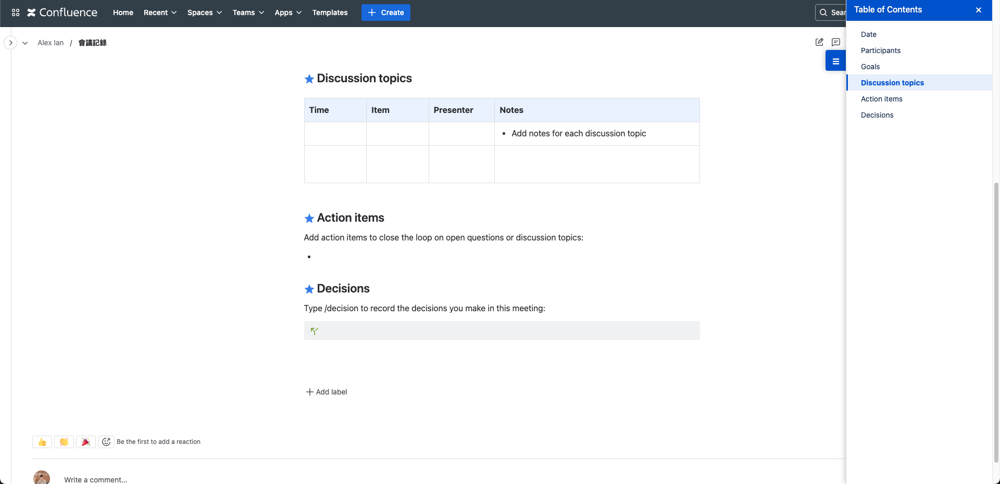

# Confluence Table of Contents Sidebar

developed with Claude 3.7 sonnet
Vibe coding with cursor

## Features

- Automatically generate a table of contents sidebar for Confluence pages
- Highlight the current page in the sidebar
- Scroll to the current page in the sidebar when it is clicked

